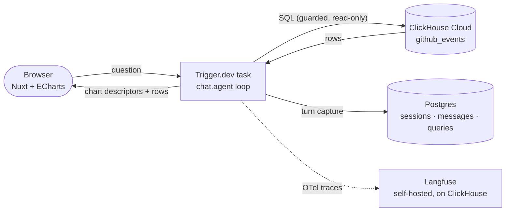

# gh-pulse

Ask questions about GitHub activity in natural language — get charts, not
paragraphs. A chat agent that writes ClickHouse SQL against 11B+ GitHub
events and answers with interactive visualisations.

Built for the ClickHouse + Trigger.dev Virtual Summer Hackathon
("Beyond the Wall of Text", July 2026).

## Stack

- **Nuxt 4 + Apache ECharts** (via the thin `vue-echarts` wrapper) — the visual
  layer is the product; ECharts was chosen over Nuxt-specific chart kits for
  its deeper catalog (calendar heatmaps, sankey, treemap, …)
- **ClickHouse Cloud** — `github_events` (OLAP, primary database)
- **Trigger.dev `chat.agent()`** — the conversational agent runtime
- **Postgres** — OLTP for the app itself: sessions, messages, rendered charts
- **Langfuse** — agent observability (itself powered by ClickHouse)

## Architecture



## What's in the data

Two tiers, one table (`github_events`, sort key `(event_type, repo_name, created_at)`):

- **Curated, full history since 2019, all event types** — the `ClickHouse`,
  `duckdb` and `vuejs` orgs, plus `facebook/react`, `microsoft/vscode`,
  `anthropics/claude-code` and `triggerdotdev/trigger.dev`. Multi-year trends,
  push rhythms, contributor churn: all answerable here.
- **Global, last 90 days** — every public repo, but only the five headline
  event types (watch/fork/issues/PRs/releases). Enough for "what's trending"
  and recent comparisons of any repo.

The agent knows this contract and words its answers (and its suggested
follow-up questions) to stay inside it.

## How it works

The agent answers every question by writing ClickHouse SQL plus a chart
descriptor `{type, x, y, series?, value?, title}` naming the columns to plot.
Guardrails wrap the SQL before it runs (single read-only SELECT, table
allowlist, keyword blocklist, LIMIT injection); query errors flow back to the
agent, which fixes its SQL and retries. The frontend validates the descriptor
against the actual result shape and renders it with ECharts — eleven panel
types (bar incl. stacked, line, area, scatter, heatmap, calendar, pie,
treemap, sankey, radar, stat cards) with a table fallback — alongside the
query itself, disclosable under every chart. Every answer ends with 2–3
model-proposed follow-up chips, phrased to be clicked verbatim.

Every chart shape is pinned down by a fixture gallery (`/?gallery=1`) that
renders all of them through the real chart component at dashboard-cell and
full width — layout regressions show up in a screenshot, not mid-demo.

Broad questions ("what can you tell me about repo X?") go through
`run_dashboard`: the agent composes 6–8 panels — headline stat cards plus a
mix of chart types — and every query runs against ClickHouse in parallel, so
a full dashboard lands in roughly the time of its slowest query.

Every completed turn is captured to Postgres (the OLTP side of the pairing):
session rollups, full messages — so past charts re-render without re-querying
ClickHouse — and one row per executed query with its SQL, chart descriptor,
row count, and ClickHouse latency. The app's own telemetry is queryable
(`infra/pg/schema.sql`) — and visible: the **App pulse** tab dashboards it
through the same chart components the agent uses (sessions, query volume,
chart-type mix, ClickHouse latency, the last queries run), served entirely
from Postgres. Capture is fail-open: it never blocks a chat turn, and without
a `DATABASE_URL` it simply switches off.

Observability closes the loop: the Trigger.dev worker exports its OTel trace
— task spans plus every model call and tool execution — to a self-hosted
[Langfuse](https://langfuse.com) (`make langfuse-up`, UI on `localhost:3005`),
which itself stores traces in its own ClickHouse. Same fail-open contract:
no Langfuse keys in the environment, no exporter.

## Running locally

Secrets never touch disk — the [1Password CLI](https://developer.1password.com/docs/cli/)
resolves `op://` references from `infra/env/.env.template` at runtime.

```bash
make install            # npm install
make secrets-bootstrap  # one-time: creates the gh-pulse vault + placeholder items
# paste real values (Trigger.dev keys, Anthropic key) — see the template header
make secrets-check      # verify every reference resolves

make ch-setup           # one-time: github_events schema + readonly role on ClickHouse Cloud
make seed               # stream the dataset from the ClickHouse playground (resumable)

make trigger-dev        # terminal 1: the chat agent
make dev                # terminal 2: Nuxt on localhost:3000
make langfuse-up        # optional: Langfuse observability on localhost:3005
```

Day-to-day: `make seed-recent` tops up the last 3 days of global events, and
`make warm` wakes ClickHouse Cloud after idle — the first query on a cold
cluster pays ~20s of resume; every one after that is milliseconds.

*Work in progress — build window 17–23 July 2026.*
